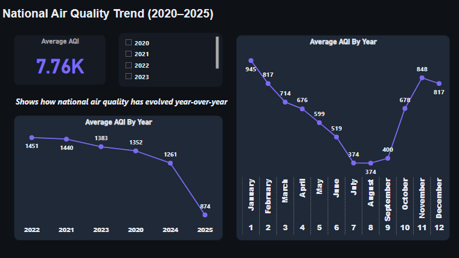
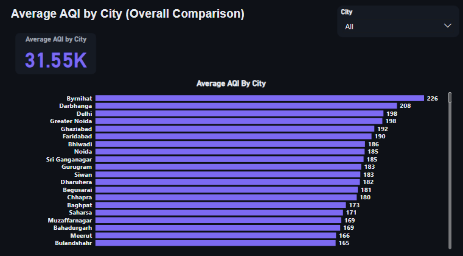
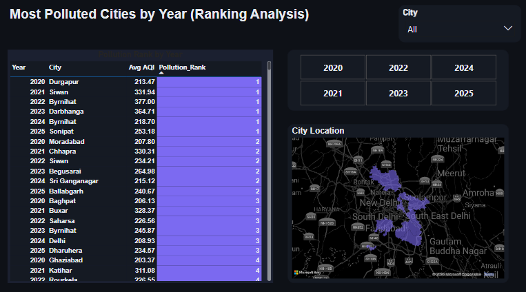

# 🌍 AQI Trend Analysis (2020–2025) | SQL & Power BI

Exploratory AQI analysis (2020–2025) using SQL (CTEs, Window Functions) and interactive Power BI dashboards.

---

## 🚀 Live Dashboard

👉 [View Power BI Dashboard](https://app.fabric.microsoft.com/view?r=eyJrIjoiY2VkOWJhZTYtNTdjNS00YzYyLWE1MzktY2JjMDRkYWZlOGZjIiwidCI6IjZkYjE1YzYxLWUzNjQtNGMyMy1iNmMzLTU4OGFjNDExNTk5MyJ9)

---

## 📌 Project Overview

This project analyzes 378K+ AQI records across India from 2020 to 2025 to evaluate:

- National air quality trends  
- Monthly and yearly pollution patterns  
- City-level pollution rankings  
- Regional severity comparisons (Delhi NCR vs Rest of India)  
- AQI volatility across cities  

The goal was to create a structured, interactive dashboard that provides clear environmental insights for public awareness and data-driven decision-making.

---

## 🗂 Dataset Details

- Source: Publicly available CPCB air quality dataset (2020–2025)
- Time Period: January 2020 – October 2025
- Coverage: 300+ Indian Cities
- Total Records: 378,000+

---

## 🛠 Tools & Technologies Used

- **SQL (PostgreSQL)**
  - Aggregations
  - CTEs
  - Window Functions
  - DENSE_RANK()
  - View Creation
  - Data Transformation

- **Power BI**
  - Interactive Slicers
  - Ranking Visuals
  - Trend Analysis Dashboards

---

## 🔎 Key Analysis Performed

### 1️⃣ Data Cleaning & Validation
- Null value checks
- Date range validation
- AQI boundary validation

### 2️⃣ National Trend Analysis
- Year-wise average AQI trend
- Daily & monthly AQI patterns
- Seasonal pollution spike detection

### 3️⃣ City-Level Analysis
- Average AQI per city
- Year-wise pollution ranking using DENSE_RANK()
- Identification of high-risk cities (e.g., Sonipat)

### 4️⃣ Regional Severity Analysis
- Comparison between Delhi NCR and Rest of India
- % of unhealthy AQI days calculation
- AQI severity categorization (Good → Severe)

### 5️⃣ Volatility Analysis
- Standard deviation of AQI per city
- Identifying cities with high pollution fluctuation

---

## 📊 Dashboard Structure (Power BI)

The dashboard consists of 5 pages:

1. National AQI Trend Overview  
2. City-wise AQI Comparison  
3. Delhi NCR Deep Dive  
4. Volatility vs Consistency  
5. Year-wise Pollution Ranking  

---

## 📸 Dashboard Preview

### National Trend

### City Comparison

### Pollution Ranking

---

## 💡 Key Insights

- AQI levels consistently peak during winter months (Nov–Jan).
- Certain cities show sharp year-over-year ranking shifts.
- Delhi NCR records a significantly higher percentage of unhealthy AQI days.
- Some cities demonstrate high volatility, indicating inconsistent environmental stability.

---

## 📂 Repository Structure

AQI-Trend-Analysis-SQL-PowerBI  
│  
├── sql/  
│   └── aqi_analysis.sql  
├── powerbi/  
│   └── AQI_Trend_Dashboard.pbix  
└── screenshots/  
    ├── national_trend.png  
    ├── city_comparison.png  
    └── pollution_ranking.png  

---

## 🎯 Conclusion

This project demonstrates end-to-end analytical capability:

- Raw data validation  
- SQL-based transformation and ranking  
- Business-style environmental insights  
- Interactive dashboard storytelling  

It highlights the ability to combine SQL analytical depth with Power BI visualization to deliver meaningful insights from large-scale datasets.

---

👤 **Author:** Enos Mohod  
📫 Connect via LinkedIn or GitHub from profile.
